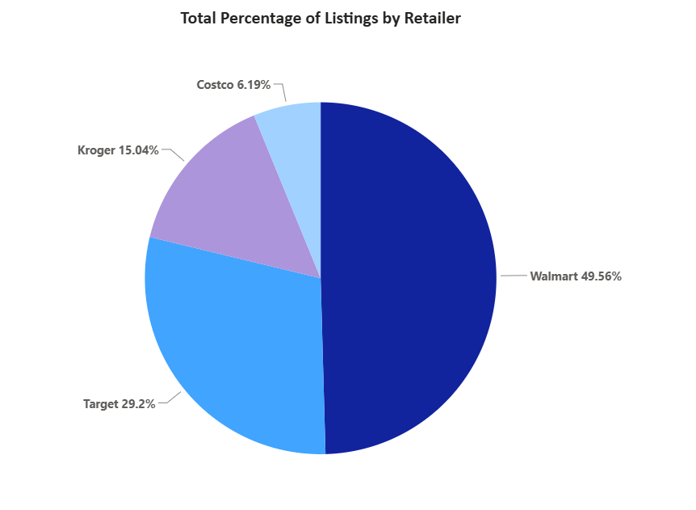
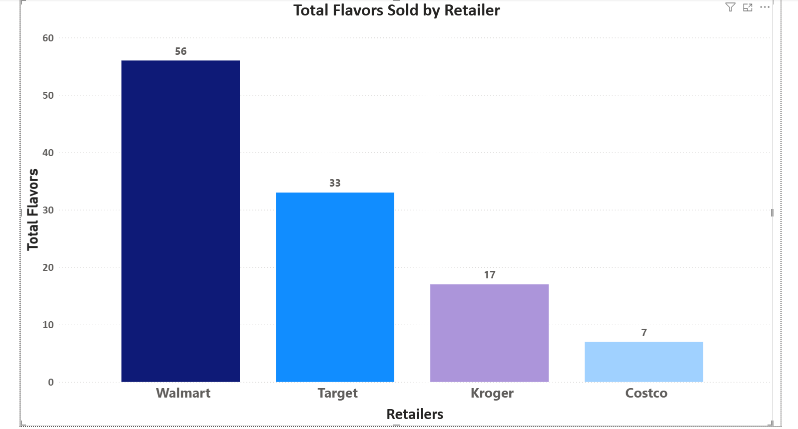

## Premier Protein Competitive Retail Analysis
A compact retail analytics project examining Premier Protein pricing and pack‑size strategy across multiple retailers. Built using a dimensional model, SQL transformations, and clean CSV‑based data ingestion.

## This project analyzes competitive pricing for Premier Protein products using:

* A fact table for catalog listings

* A fact table for promotions

* Dimension tables for products, flavors, pack sizes, and retailers

* SQL for schema creation, data loading, and analysis

## The goal is to understand unit price differences, pack‑size strategy, and retailer‑specific pricing behavior.

## Data Model (Actual Tables)
Dimensions
* dim_products – Product name, category

* dim_flavors – Flavor descriptions

* dim_pack_sizes – Units per pack (e.g., “18-pack”)

* dim_retailers – Retailer name, channel

## Facts
* fact_catalog – Base price, retailer, product, pack size, date

* fact_promotions – Promo type, promo value, promo price, start/end dates

Dates are stored directly in the fact tables, not in a separate date dimension.

## SQL Components
* Table creation scripts

* Foreign key relationships

* Data loading from CSV

* Analysis queries for:

* Unit price comparison

## Selected Insights 
*Walmart accounted for nearly half of the total listings in this retail dataset. 

*Walmart continues to deliver on flavor assortment options through its online channel. 

